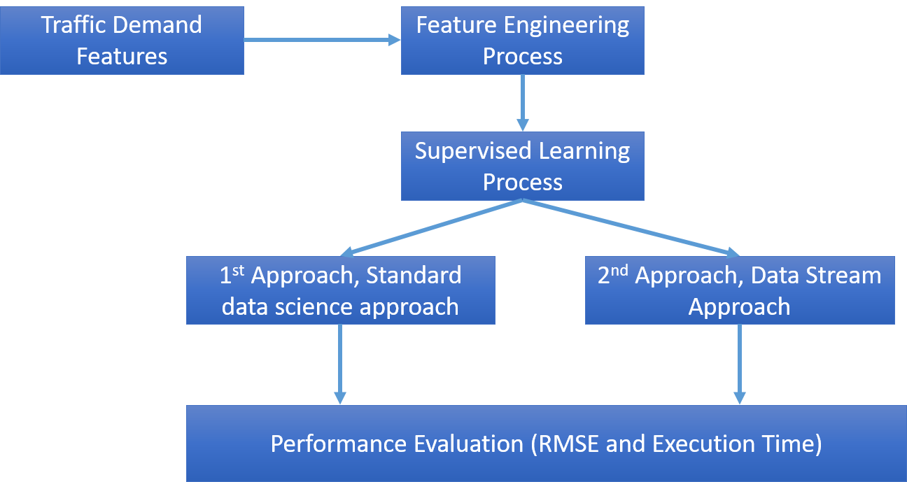

# Traffic Demand Prediction

Fig.1. Research Diagram

## Result Hightlight

I use two approaches in processing predictions from traffic demand shown in
Fig.1. The first approach is the standard data science approach, namely the
standard data science process approach, which performs a feature selection, and
then the feature is included in the algorithm learning machine. The second
approach is to use a data stream model approach.

This approach is used because seeing the potential for this dataset can be very
large because it is a travel demand data that is rapidly generated by many
users. Simple machine learning approach has the potential to have weaknesses
when the data becomes very large because the training process will consume CPU
memory so in this problem, I try to approach the data stream so that the
learning process can be done in a stream and iterative manner. It is expected
that with this approach, the memory of the CPU does not experience exhaust
resources when the data becomes very large.

Table.1. RMSE evaluation uses Standard machine learning and data streams

| Standard Machine Learning | Standard Machine Learning   |  Standard Machine Learning             |Data Stream         |  Data Stream             |
|---------------------------|---------------|---------------|---------|---------------|
| Linear Regression         | Decision Tree | Random Forest | FIMT-DD | FIMT-DD-ARDEV |
| 0.15                      | 0.042         | 0.034         | 0.10    | 0.06          |

Based on Table.1, I use a standard machine learning and data stream model to see
RMSE performance from traffic demand data. For the data stream model algorithm,
I tried to propose an improvement of the algorithm with the name FIMT-DD-ARDEV
with changes to the bound the use of standard deviations for splitting trees. To
use a data stream, the FIMT-DD-ARDEV model has better RMSE performance compared
to FIMT-DD (standard data stream algorithm). With RMSE values ​​of 0.10 (FIMT-DD)
and 0.06 (FIMT-DD-ARDEV). In standard machine learning, random forest has the
best RMSE, which is 0.034.

In Table.1. Indeed, it can be seen that the results of the machine learning
standard with random forest have smaller RMSE values ​​compared to the data stream
model. However, keep in mind that the data will gradually increase due to
generated data from user behavior, especially if the area of ​​coverage increases.
It will be a big problem when the standard machine learning algorithm requires
resource memory to fit all data in memory. Resource memory will run out when the
data that has to be trained increases continuously. Therefore on this challenge,
I tried to use two approaches. The standard machine learning approach and the
data stream approach, where the data stream approach will do iterative training
based on the incoming data stream.

## Detailed Analysis and Documentation
* [Analysis and Documentation](documentation/Analysis-and-documentation.pdf) - Please download this guide to see the result and the documentation.

## Datasets and saved model
* [combine.csv](https://www.dropbox.com/s/70kjg5jq5ergqd5/combine.csv?dl=0) - Combine decrypted geohash with existing features in training.csv.
* [combine-traffic-demand.arff](https://www.dropbox.com/s/imx4vhwd8ya1h0i/combine-traffic-demand.arff?dl=0) - Arff file for data stream learning.
* [rf-traffic-demand.sav](https://www.dropbox.com/s/lw62uvi937nbrcg/rf-traffic-demand.sav?dl=0) - Saved model from tradiational machine learning.
